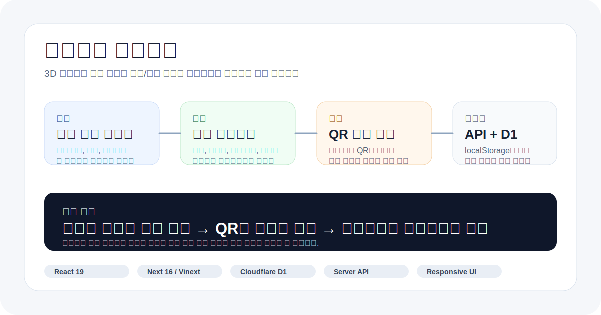
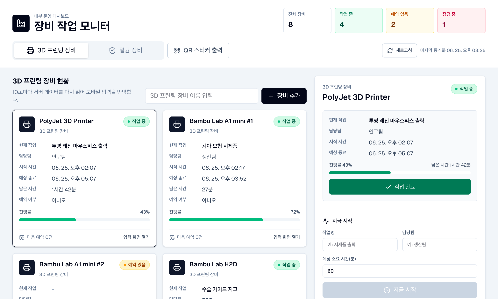
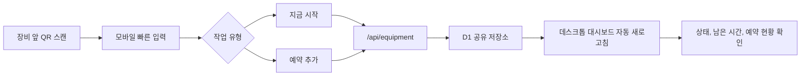
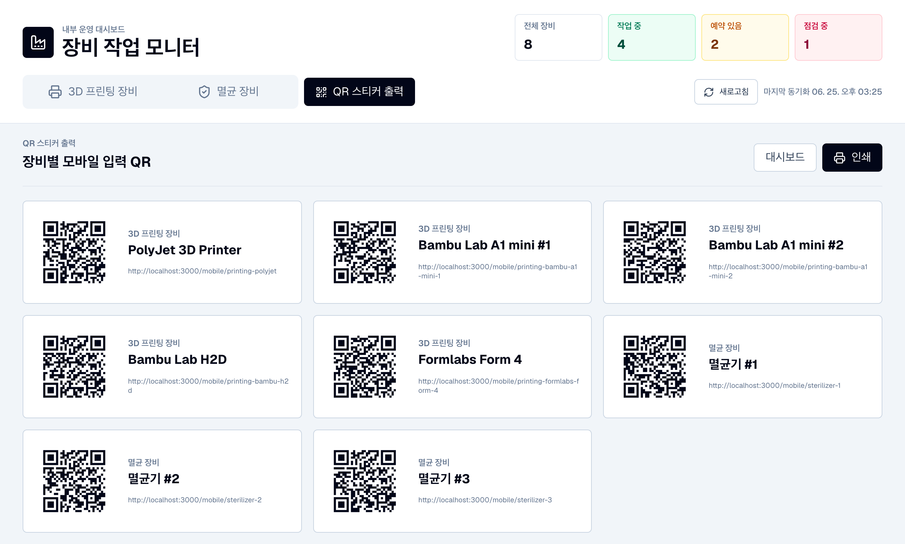
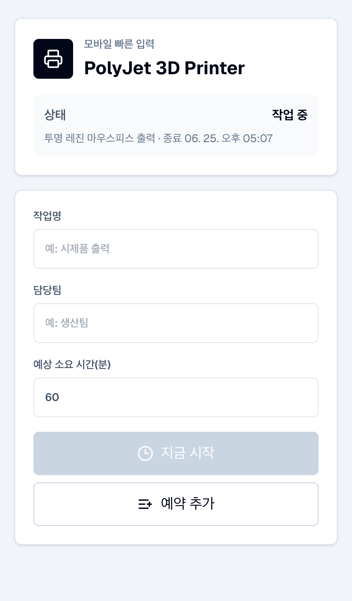
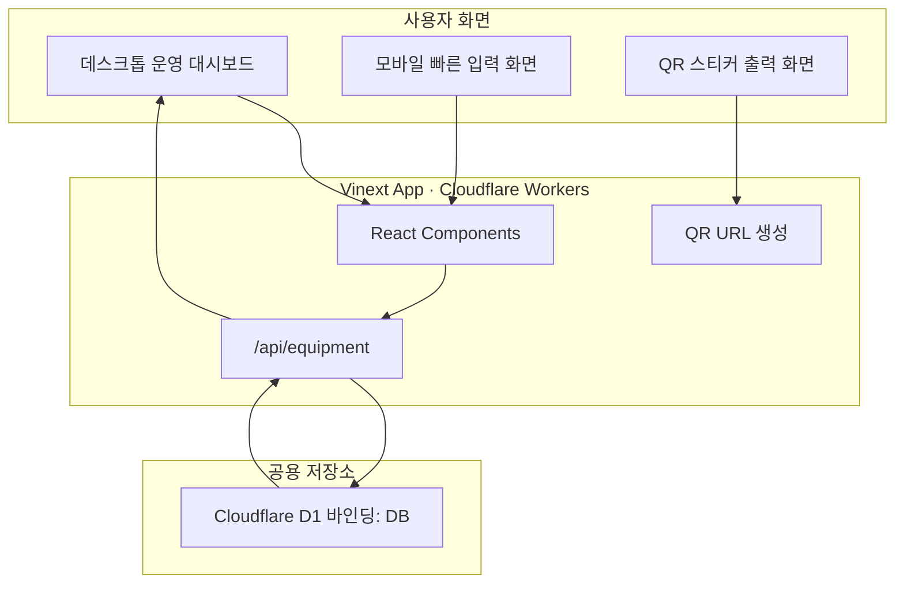

# 장비관리 프로젝트



3D 프린터와 멸균 장비의 작업 시작 시간, 예상 종료 시간, 남은 시간,
예약 현황을 한 화면에서 공유하는 사내 운영 대시보드입니다. 장비 앞에서 QR을
스캔해 모바일로 작업을 입력하면, 데스크톱 대시보드에도 서버 저장소 기준으로
반영되도록 설계했습니다.

> 포트폴리오 관점의 핵심은 `현장 장비 사용 현황을 누구나 확인할 수 있게 만든 운영 도구`입니다.



## 문제 정의

공용 장비는 사용 중인지, 언제 끝나는지, 다음 예약이 있는지 확인하는 과정이
흩어지기 쉽습니다. 특히 3D 프린터와 멸균 장비처럼 작업 시간이 긴 장비는
사용 가능 여부를 매번 물어보거나 현장에 직접 가서 확인해야 하는 비용이
생깁니다.

이 프로젝트는 장비별 현재 상태와 예약 정보를 웹 대시보드로 모으고, 장비별
QR 입력 화면을 제공해 현장 입력과 사무실 확인 흐름을 연결합니다.

## 핵심 기능

| 영역 | 기능 | 구현 포인트 |
| --- | --- | --- |
| 장비 현황 | 상태, 현재 작업명, 담당팀, 시작/종료 시간, 남은 시간, 진행률 표시 | 시간 기반 진행률 계산과 주기적 새로고침 |
| 작업 입력 | 장비 클릭 후 작업명, 담당팀, 예상 소요 시간 입력 | 지금 시작, 작업 완료, 예약 추가 액션 분리 |
| 모바일 입력 | QR 스캔 시 장비별 빠른 입력 화면으로 이동 | 모바일에서 필요한 필드만 남긴 간소화 UI |
| 예약 관리 | 장비별 다음 예약 여부와 예약 목록 표시 | 장비 카드와 상세 패널에서 같은 데이터 공유 |
| QR 출력 | 장비별 QR 코드와 장비명을 라벨 형태로 출력 | 현장 부착용 스티커 페이지 제공 |
| 공유 저장소 | localStorage가 아닌 서버 API와 D1 사용 | 휴대폰 입력이 데스크톱 대시보드에 반영 |

## 사용자 흐름



장비별 QR 스티커를 출력해 부착하고, 현장에서 휴대폰으로 스캔하면 해당 장비의
모바일 빠른 입력 화면으로 바로 이동합니다.

**QR 스티커 출력 화면** — 장비별 모바일 입력 QR을 한 번에 인쇄



**모바일 빠른 입력** — QR을 스캔하면 열리는 현장 작업 등록 화면

<p align="center">
  
</p>

## 시스템 구조



## 기본 장비 구성

| 3D 프린팅 장비 | 멸균 장비 |
| --- | --- |
| PolyJet 3D Printer | 멸균기 #1 |
| Bambu Lab A1 mini #1 | 멸균기 #2 |
| Bambu Lab A1 mini #2 | 멸균기 #3 |
| Bambu Lab H2D |  |
| Formlabs Form 4 |  |

## 기술 스택

| 구분 | 사용 기술 |
| --- | --- |
| Frontend | React 19, Next 16, Vinext |
| Styling | CSS, responsive layout |
| Backend | Server API route |
| Database | Cloudflare D1, Drizzle ORM |
| Deployment Target | Cloudflare Workers (Vinext) |
| UX | Desktop dashboard, mobile quick entry, print layout |

## 설계 포인트

- 첫 화면을 소개 페이지가 아닌 실제 업무 대시보드로 구성했습니다.
- 모바일 QR 입력 화면은 현장에서 빠르게 입력하도록 필드를 최소화했습니다.
- 장비 데이터의 원본을 브라우저 localStorage에 두지 않고 서버 API와 D1로
  통일했습니다.
- 대시보드는 주기적으로 데이터를 다시 읽어 다른 기기에서 입력한 내용을
  반영합니다.
- 장비 카드, 상세 입력 패널, QR 출력 화면이 같은 장비 모델을 기준으로
  동작하도록 구성했습니다.

## Quick Start

```bash
npm install
npm run dev
```

빌드 확인:

```bash
npm run build
```

## Deployment

Cloudflare Workers(Vinext) 환경에 배포합니다. D1 데이터베이스를 생성하고
바인딩 이름을 `DB`로 연결한 뒤, `drizzle/` 마이그레이션을 적용하면 됩니다.
로컬 개발에서는 `vite.config.ts`의 플레이스홀더 바인딩으로 동작합니다.

## Useful Commands

| command | description |
| --- | --- |
| `npm run dev` | 로컬 개발 서버 실행 |
| `npm run build` | Vinext 빌드 검증 |
| `npm run lint` | ESLint 검사 |
| `npm run db:generate` | Drizzle migration 생성 |
